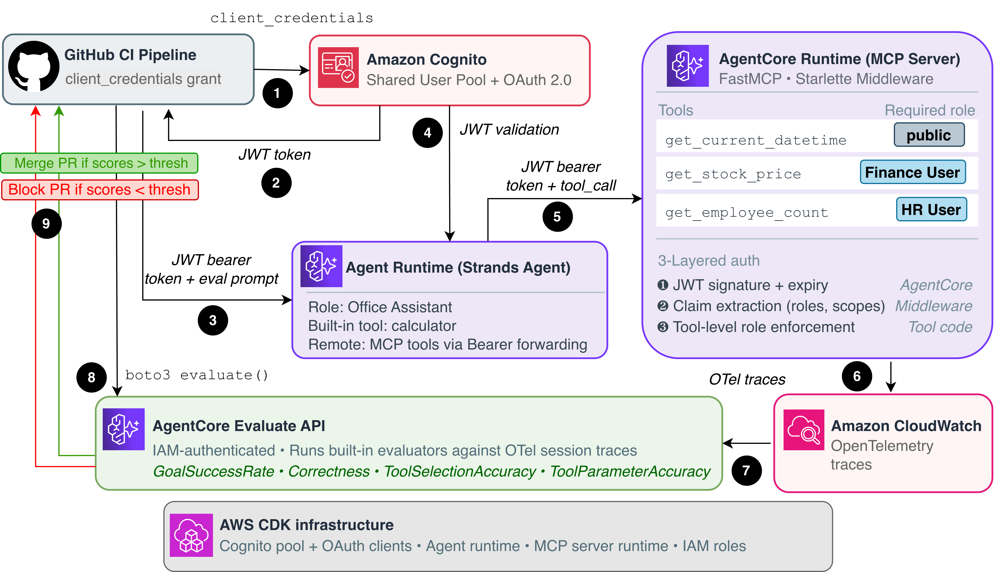

# AgentCore Evaluation Pipeline with MCP Role-Based Access Control

Reference implementation for running automated evaluations on an [Amazon Bedrock AgentCore](https://docs.aws.amazon.com/bedrock-agentcore/latest/devguide/what-is-bedrock-agentcore.html)-hosted agent that connects to an MCP server with role-based access control. The CI/CD pipeline deploys infrastructure, invokes the agent, runs evaluations, and gates the PR on quality thresholds.

## Architecture



## Auth Flows

**M2M (CI pipelines):** `client_credentials` grant → Cognito issues an access token carrying the scopes granted to the M2M client → MCP `AuthMiddleware` matches those scopes against each tool's declared scope requirement. A machine caller reaches only the tool domains whose scopes it was granted (`mcp/finance`, `mcp/hr`); there is no bypass.

**User-scoped (interactive):** `ADMIN_NO_SRP_AUTH` or `authorization_code` grant → Cognito issues access token with `custom:roles` claim (via pre-token-generation Lambda V2) → agent forwards token to MCP via `request_header_allowlist` → `AuthMiddleware` extracts roles → tool-level checks enforce access (e.g., only `FinanceUser` can call `get_stock_price`).

## MCP Auth Layers

1. **JWT validation (AgentCore):** Signature, issuer, expiry verified by the platform via `authorizer_configuration` before the request reaches your code.
2. **Header passthrough:** `request_header_allowlist=["Authorization"]` on both runtimes ensures the JWT reaches the agent and MCP containers.
3. **Tool-level authorization (`AuthMiddleware`):** Uses `fastmcp.server.dependencies.get_http_headers()` to read the JWT, verifies its signature against the pool's JWKS (issuer, expiry and `token_use` are checked; it fails closed), then authorizes each tool against the `meta` it declares. A gated tool requires a matching `custom:roles` entry **or** a matching scope — user tokens satisfy the role requirement, machine tokens the scope requirement. A newly added gated tool is denied until its scope is explicitly granted.

## Model Guardrail

A [Amazon Bedrock Guardrails](https://aws.amazon.com/bedrock/guardrails/) guardrail is attached to the agent's model, so filtering is enforced by the platform
rather than by asking the model to behave. It applies:

- **Content filters** on hate, insults, sexual content, violence and misconduct, on both input
  and output.
- **Prompt-attack detection** on input. This matters most here: the agent forwards the caller's
  JWT to role-gated MCP tools, so a successful injection could try to misuse a tool the caller
  can otherwise reach.
- **A denied topic** covering attempts to extract credentials, secrets, tokens or environment
  variables.
- **A profanity word list**, and **PII rules** that block credentials and financial identifiers
  (AWS keys, passwords, card and SSN) and mask contact details (email, phone).

Two filters are deliberately *not* configured, because they would break correct behaviour:

- **No financial or investment denied topic.** `What is the stock price of AAPL?` is a supported
  request; a topic filter there would block normal use.
- **No `NAME` or `ADDRESS` PII rule.** The HR tool returns department names and the finance tool
  returns ticker symbols, and masking those would corrupt correct answers and depress the very
  evaluation scores this pipeline measures.

The guardrail is referenced by published version, not `DRAFT`, so editing it cannot silently
change behaviour under a running agent. `GUARDRAIL_ID` and `GUARDRAIL_VERSION` are passed to the
runtime together — the agent sends a guardrail configuration only when both are present, so it
still runs when the guardrail is absent.

A CloudWatch alarm fires on `InvocationsIntervened` in the `AWS/Bedrock/Guardrails` namespace.
An intervention means either a genuine attack or a filter too aggressive for legitimate traffic,
and both are worth investigating. Note that this metric can take several minutes to appear after
an intervention.

## Repo Structure

```
├── README.md                        # This file
├── app.py                           # CDK entry point
├── pyproject.toml                   # Root CDK dependencies
├── cdk.json                         # CDK config
├── agent/
│   ├── Dockerfile
│   ├── pyproject.toml
│   └── src/
│       └── assistant_agent.py       # Strands agent with MCP client
├── mcp-server/
│   ├── Dockerfile
│   ├── pyproject.toml
│   ├── server.py                    # FastMCP server with role-gated tools
│   └── src/
│       ├── auth/
│       │   ├── middleware.py        # AuthMiddleware for role-based tool access
│       │   ├── models.py           # AccessToken Pydantic model
│       │   └── utils.py            # Token parsing via get_http_headers()
│       └── exceptions.py
├── infrastructure/
│   ├── stack.py                     # CDK stack (Cognito + both runtimes)
│   ├── roles.py                     # IAM roles for AgentCore
│   └── pre_token_lambda/
│       └── index.py                 # Copies custom:roles into access tokens
├── fixtures/
│   └── sample_traces.json           # Pre-collected OTel traces
├── scripts/
│   ├── agentcore_eval.py            # Eval script (live invocation, used by CI)
│   ├── evaluation_pipeline.py       # Eval pipeline walkthrough (deploy separately first)
│   ├── deploy_and_test_rbac.py      # Deploy the stack and verify role enforcement
│   ├── evaluate_stored_traces.py    # Evaluate pre-collected fixtures
│   └── eval_dataset.json            # Test prompts
├── .github/
│   └── workflows/
│       └── agentcore-eval.yml       # CI/CD pipeline
```

## Prerequisites

- AWS account with Bedrock AgentCore access
- Python 3.12+
- Node.js 20+ and the AWS CDK CLI (`npm install -g aws-cdk`) — the CLI is a Node package and is
  *not* installed by `pip install .`, which only provides the Python `aws-cdk-lib` used by `app.py`
- CDK bootstrapped in `ap-southeast-2` (`cdk bootstrap aws://<account-id>/ap-southeast-2`) — the
  region is pinned in `app.py`, so bootstrapping only your default region is not enough
- Docker installed and running. Both images build for `linux/arm64`: this is native on Apple
  Silicon, but on x86 hosts you need emulation (`docker run --privileged --rm tonistiigi/binfmt --install arm64`),
  which is what the CI workflow's QEMU step provides

## Quick Start

The fastest way to get started is to run the two walkthrough scripts:

1. `python scripts/deploy_and_test_rbac.py --password '<password>'` — deploys the stack,
   sets the two test users' passwords, and verifies role-based access control (RBAC)
   end-to-end.
2. `python scripts/evaluation_pipeline.py` — runs the evaluation pipeline with an M2M token
   and applies the quality gates against the deployed stack.

`deploy_and_test_rbac.py` deploys the stack itself (pass `--skip-deploy` to test an
already-deployed one); `evaluation_pipeline.py` reads the `outputs.json` that the deploy
writes, so run the RBAC script first. Run both from the repository root with the `.venv`
active, and see [Testing](#testing) for the full options. They do **not** tear the stack
down — run `cdk destroy --force` yourself when finished (see [Teardown](#teardown)).

### `deploy_and_test_rbac.py`

Deploys the stack (via `npx aws-cdk@2`, unless `--skip-deploy` is given) and verifies role
enforcement against it. It sets a permanent password for the pre-created Cognito users
(`user-a` as `FinanceUser`, `user-b` as `HRUser`), waits for the runtimes' containers to
start, then authenticates as each user and checks that role-gated tools are reachable only
by the matching role:

| User   | Role        | `get_stock_price` | `get_employee_count` | Public tools |
|--------|-------------|:-----------------:|:--------------------:|:------------:|
| user-a | FinanceUser | Allowed           | Denied               | Yes          |
| user-b | HRUser      | Denied            | Allowed              | Yes          |

The password can be passed with `--password`, set via `TEST_USER_PASSWORD`, or entered
interactively. It must satisfy the Cognito policy (12+ chars, upper, lower, digit, symbol).
The script exits non-zero if any RBAC check fails.

### `evaluation_pipeline.py`

Mirrors the CI pipeline against the deployed stack: it fetches the M2M client secret from
Secrets Manager, gets an M2M token via the `client_credentials` grant, invokes the agent
with a set of test prompts under a single session ID (so traces are grouped), scores the
session with built-in evaluators, and applies a quality gate. Pass `--threshold` to change
the pass mark (default `0.8`); the script exits non-zero if any metric falls below it.

Both scripts pause a fixed 30s for containers to warm up rather than polling for `READY`
(which `scripts/agentcore_eval.py` does). If an invocation returns `424 Failed Dependency`,
the runtimes were not ready yet — re-run the script.

## Deployment

```bash
# Install the Python CDK libraries that app.py imports (aws-cdk-lib, constructs)
python3 -m venv .venv
source .venv/bin/activate
pip install .

# Deploy the stack (requires the CDK CLI — see Prerequisites)
cdk deploy --outputs-file outputs.json

# No global CDK CLI? Run it via npx instead:
# npx aws-cdk@2 deploy --outputs-file outputs.json
```

The stack deploys into `ap-southeast-2` (pinned in `app.py`) using the account resolved from your
current credentials. Deployment builds and pushes both container images to ECR before creating the
AgentCore runtimes, so allow around 10-15 minutes on a first run.

Both runtimes stay in `CREATING` for a few minutes after `cdk deploy` returns, and invoking one
before it reaches `READY` fails with `424 Failed Dependency`. `scripts/agentcore_eval.py` polls for
`READY` before invoking; the walkthrough scripts (`deploy_and_test_rbac.py`,
`evaluation_pipeline.py`) instead pause for a fixed 30s, which is usually but not always
enough — if an invocation returns 424, re-run the script.

CDK outputs include: `SharedUserPoolId`, `M2MClientId`, `UserClientId`, `TokenEndpoint`, `MCPRuntimeId`, `MCPRuntimeArn`, `AgentRuntimeId`, `AgentRuntimeArn`.

## Testing

### Role-based access tests

Run `python scripts/deploy_and_test_rbac.py --password '<password>'` to deploy the stack and
verify role enforcement (add `--skip-deploy` to test an already-deployed stack). See
[Quick Start](#quick-start) for what it checks and the available options.

### M2M (CI-style) invocation

```bash
# Get M2M token (client secret stored in Secrets Manager: agentcore/dev/m2m-client)
TOKEN=$(curl -s -X POST "$TOKEN_ENDPOINT" \
  -H "Content-Type: application/x-www-form-urlencoded" \
  -d "grant_type=client_credentials&client_id=$M2M_CLIENT_ID&client_secret=$M2M_CLIENT_SECRET&scope=mcp/invoke mcp/finance mcp/hr agentcore/invoke" \
  | jq -r '.access_token')

# Invoke agent
curl -X POST "https://bedrock-agentcore.$REGION.amazonaws.com/runtimes/$(python3 -c "import urllib.parse; print(urllib.parse.quote('$AGENT_ARN', safe=''))")/invocations?qualifier=DEFAULT" \
  -H "Authorization: Bearer $TOKEN" \
  -H "Content-Type: application/json" \
  -d '{"prompt": "What is the stock price of AAPL?"}'
```

### Run evaluations locally

```bash
cd scripts
export AGENT_RUNTIME_ARN="..."
export AGENT_RUNTIME_ID="..."
export TOKEN_ENDPOINT="..."
export OAUTH_CLIENT_ID="..."
export OAUTH_CLIENT_SECRET="..."
export OAUTH_SCOPE="mcp/invoke mcp/finance mcp/hr agentcore/invoke"
export EVAL_THRESHOLD="0.8"

pip install boto3 requests bedrock-agentcore
python3 agentcore_eval.py
```

## CI/CD Setup

The workflow runs on every pull request to `main`: it deploys the stack, invokes the agent, scores the
responses and fails the PR if any metric falls below `EVAL_THRESHOLD`. That means **a pull request causes
AWS credentials to be issued**, so the role it assumes needs scoping carefully — a role trusted by
`repo:OWNER/REPO:*` with `iam:*` permissions can be assumed by any PR in that repo and used to modify IAM.

The three steps below keep the PR-gating behaviour intact while bounding what a PR can do.

### 1. Trust the OIDC provider, scoped to this repo *and* the environment

If the account has no GitHub OIDC provider yet, create one for
`token.actions.githubusercontent.com` with audience `sts.amazonaws.com` (only one per account is allowed).

Then create a role whose trust policy names **both the repository and the environment**:

```json
{
  "Version": "2012-10-17",
  "Statement": [{
    "Effect": "Allow",
    "Principal": { "Federated": "arn:aws:iam::<ACCOUNT_ID>:oidc-provider/token.actions.githubusercontent.com" },
    "Action": "sts:AssumeRoleWithWebIdentity",
    "Condition": {
      "StringEquals": {
        "token.actions.githubusercontent.com:aud": "sts.amazonaws.com",
        "token.actions.githubusercontent.com:sub": "repo:<OWNER>/<REPO>:environment:dev"
      }
    }
  }]
}
```

Two details matter:

- **`environment:dev`, not `:*`.** GitHub only issues a token with this subject when the job declares
  `environment: dev`, which the `evaluate` job does. A trailing `:*` would let any branch, tag or PR in the
  repo assume the role.
- **`StringEquals`, not `StringLike`.** With `StringLike` plus a wildcard, a subject you did not intend can
  match.

### 2. Require a reviewer on the `dev` environment

In **Settings → Environments → `dev`**, add **Required reviewers**.

This is what makes PR-triggered deployment safe: credentials are not issued until a maintainer approves the
run, so a pull request containing hostile changes cannot reach AWS on its own. The quality gate still works
exactly as intended — it just waits for one approval on untrusted contributions.

### 3. Grant only what the workflow needs

`iam:*` on `Resource: "*"` lets anything that assumes the role create or modify arbitrary roles and
policies — that is account takeover, not a deployment permission. The policy below is what this workflow
actually requires. Replace `<ACCOUNT_ID>`, and `AgentCoreCICDStack-*` if you rename the stack.

```json
{
  "Version": "2012-10-17",
  "Statement": [
    {
      "Sid": "CdkDeployPlumbing",
      "Effect": "Allow",
      "Action": ["cloudformation:*", "ecr:*", "logs:*"],
      "Resource": "*"
    },
    {
      "Sid": "CdkBootstrapVersionAndRoles",
      "Effect": "Allow",
      "Action": ["ssm:GetParameter", "sts:AssumeRole"],
      "Resource": [
        "arn:aws:ssm:*:<ACCOUNT_ID>:parameter/cdk-bootstrap/*",
        "arn:aws:iam::<ACCOUNT_ID>:role/cdk-*"
      ]
    },
    {
      "Sid": "StackResourceManagement",
      "Effect": "Allow",
      "Action": ["cognito-idp:*", "bedrock-agentcore:*", "cloudwatch:*"],
      "Resource": "*"
    },
    {
      "Sid": "EvaluationModelInvocation",
      "Effect": "Allow",
      "Action": ["bedrock:InvokeModel", "bedrock:InvokeModelWithResponseStream"],
      "Resource": "*"
    },
    {
      "Sid": "StackSecrets",
      "Effect": "Allow",
      "Action": [
        "secretsmanager:GetSecretValue", "secretsmanager:DescribeSecret",
        "secretsmanager:CreateSecret", "secretsmanager:DeleteSecret", "secretsmanager:TagResource",
        "secretsmanager:PutSecretValue", "secretsmanager:UpdateSecret", "secretsmanager:GetResourcePolicy"
      ],
      "Resource": "arn:aws:secretsmanager:*:<ACCOUNT_ID>:secret:agentcore/*"
    },
    {
      "Sid": "TraceReadForEvaluation",
      "Effect": "Allow",
      "Action": ["xray:BatchGetTraces", "xray:GetTraceSummaries"],
      "Resource": "*"
    },
    {
      "Sid": "StackExecutionRolesOnly",
      "Effect": "Allow",
      "Action": [
        "iam:CreateRole", "iam:DeleteRole", "iam:GetRole", "iam:PassRole", "iam:TagRole", "iam:UntagRole",
        "iam:AttachRolePolicy", "iam:DetachRolePolicy", "iam:PutRolePolicy", "iam:DeleteRolePolicy",
        "iam:GetRolePolicy", "iam:ListRolePolicies", "iam:ListAttachedRolePolicies",
        "iam:UpdateAssumeRolePolicy"
      ],
      "Resource": [
        "arn:aws:iam::<ACCOUNT_ID>:role/AgentCoreCICDStack-*",
        "arn:aws:iam::<ACCOUNT_ID>:role/cdk-*"
      ]
    }
  ]
}
```

Four of these are easy to miss:

- **`sts:AssumeRole` on `cdk-*`.** CDK bootstrap v2 does the real work through its own deploy, file-publishing
  and cfn-exec roles. Without permission to assume them, `cdk deploy` fails immediately regardless of what
  else the role can do.
- **`iam:UpdateAssumeRolePolicy`.** `infrastructure/roles.py` adds a statement to the agent role's trust
  policy, so creating the role is not enough on its own.
- **Secrets Manager.** The workflow reads the M2M client secret directly rather than passing it through step
  outputs, so it needs read access as well as the create/delete the stack performs.
- **The IAM statement must stay resource-scoped.** Scoped to the stack's own role names, a compromised run can
  manage this stack's roles and nothing else.

Worth verifying rather than assuming, since a missing action only shows up mid-deploy:

```bash
aws iam simulate-principal-policy \
  --policy-source-arn arn:aws:iam::<ACCOUNT_ID>:role/<ROLE_NAME> \
  --action-names sts:AssumeRole iam:CreateRole secretsmanager:GetSecretValue \
  --resource-arns arn:aws:iam::<ACCOUNT_ID>:role/cdk-hnb659fds-deploy-role-<ACCOUNT_ID>-<REGION>
```

Confirm the escalation paths are denied too — `iam:CreateUser`, `iam:CreateAccessKey`, `iam:PutUserPolicy`,
and `iam:CreateRole` against a role outside the stack's own names should all come back `implicitDeny`.

### 4. Add the role ARN as a secret

Add the role ARN as the repository secret `AWS_ROLE_ARN`. <!-- pragma: allowlist secret --> <!-- reason: GitHub Actions secret NAME, not a credential value -->
If you define it as an *environment* secret instead, it must be on the `dev` environment, since that is what
the `evaluate` job targets.

The workflow checks this secret before configuring credentials and fails with an explicit message if it is
absent — otherwise the credentials action retries twelve times and reports only
`Could not load credentials from any providers`, which does not mention the secret.

> **Fork pull requests cannot pass.** GitHub withholds secrets from workflows triggered by PRs from forks, so
> the deploy-and-evaluate job cannot authenticate for external contributions. The `security-scan` job needs no
> credentials and still runs. If you require the evaluation check for merge, expect to run it on a branch in
> this repository rather than on a fork PR.

## Teardown

```bash
source .venv/bin/activate
cdk destroy --force
```
