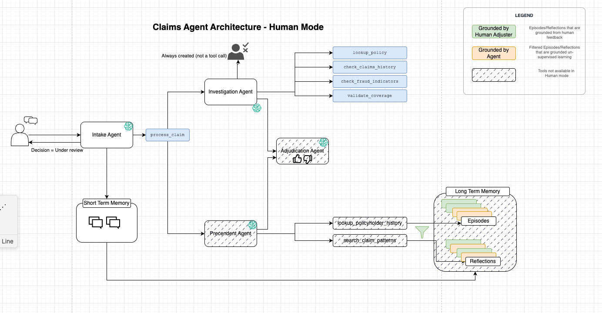
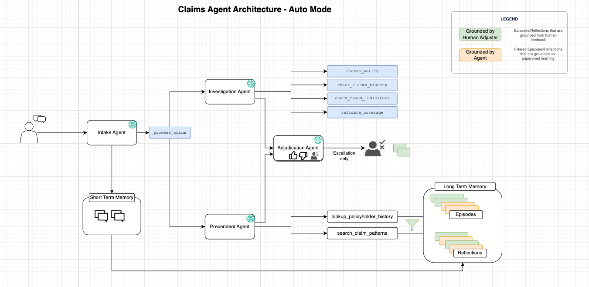
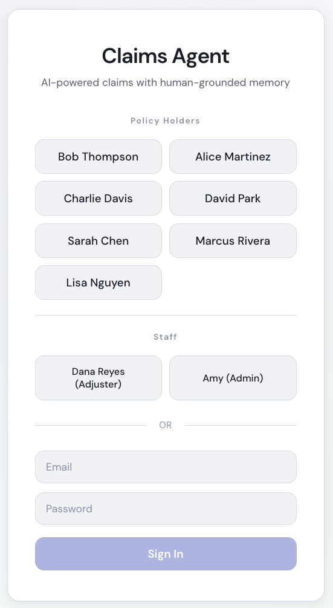

# Episodic Memory Claims Agent

## Overview

A multi-agent insurance claims processing system that demonstrates how **Amazon Bedrock AgentCore Episodic Memory** enables AI agents to learn from human decisions and improve over time — without retraining.

Organizations have institutional knowledge embedded in their human workforce — the senior adjuster who knows when a delayed report is suspicious vs. when it's just a busy parent who forgot. Today's agentic workflows don't inherit any of that. Every agent session starts from zero.

This sample solves that problem using AgentCore's episodic memory as a **cross-session knowledge transfer mechanism**. When human experts make decisions through the system, those decisions are extracted into episodes and generalized into reflections. These reflections capture nuanced patterns like "approve when a medium fraud score (25-35/100) is accompanied by strong third-party corroboration such as police reports, security footage, and professional estimates — documentation quality overcomes the elevated risk signal." This is institutional knowledge that was previously locked in human heads — not just simple rules, but judgment calls that consider context.

The key innovation is **trust-filtered retrieval**: not all interactions produce reliable insights. An agent-only session might hallucinate reasoning; an inexperienced operator might make a bad call. To prevent poisoning, each interaction is tagged at the source with a `grounding_source` metadata field (inferred by the extraction LLM). When the agent retrieves patterns for autonomous decisions, it filters to only human-adjuster-grounded reflections — ensuring the system learns only from verified expertise.

### Use case details

| Information | Details |
|-------------|---------|
| Use case type | Conversational + Workflow Automation |
| Agent type | Multi-Agent (Strands Graph) |
| AgentCore components | Runtime, Memory (Episodic), Cognito Auth |
| Other components | Amazon Cognito, API Gateway, Lambda, DynamoDB, SSM Parameter Store |
| Agentic framework | Strands Agents + GraphBuilder |
| LLM model | Claude Sonnet 4.6 |
| Use case vertical | Insurance |
| Example complexity | Advanced |
| SDK used | bedrock-agentcore, strands-agents |

### What This Demonstrates

- **Learning loop** — Human adjuster decisions become [retrievable patterns](https://docs.aws.amazon.com/bedrock-agentcore/latest/devguide/long-term-retrieve-records.html) that inform future autonomous decisions across all claims
- **Trust-filtered memory** — [Metadata-indexed](https://docs.aws.amazon.com/bedrock-agentcore/latest/devguide/long-term-memory-metadata.html) `grounding_source` tag ensures only human-validated patterns are used in autonomous mode, preventing poisoning from unverified agent-only sessions
- **Active precedent analysis** — Unlike raw memory retrieval, the Precedent Agent filters irrelevant patterns and explains why each remaining one applies to the current claim
- **Structured auditable decisions** — 6-section reasoning rubric (Policy, Coverage, Fraud, Precedent, History, Decision) with scannable verdict tags for staff review
- **Human-in-the-loop escalation** — Ambiguous claims route to human adjusters with full context, and their decisions feed back into memory as new training signals

## Architecture

The system has two operating modes: **Training** and **Autonomous**.

### Training Mode

Also referred to as "human mode" in the codebase. In training mode, claims are investigated but NOT decided by the agent. Instead, a review task is filed for a human adjuster. The adjuster's decision gets extracted into episodic memory with `grounding_source: human_adjuster`. This is how the system accumulates institutional knowledge.



https://github.com/awslabs/agentcore-samples/raw/main/02-use-cases/01-conversational-agents/episodic-memory-claims-agent/images/demo-training-mode.webm

### Autonomous Mode

In auto mode, the full graph runs two agents in parallel: the **Investigation Agent** gathers factual evidence (policy status, coverage determination, fraud risk score, claims history) using simulated database lookups, while the **Precedent Agent** searches episodic memory for relevant patterns from past human adjuster decisions across all policyholders and retrieves this specific policyholder's prior claim episodes. Both feed into the **Adjudication Agent**, which weighs the factual evidence against the learned patterns to produce a decision. If the agent encounters ambiguity (uncertain coverage, borderline fraud score with conflicting signals), it escalates to a human adjuster — creating another training signal for the loop.



https://github.com/awslabs/agentcore-samples/raw/main/02-use-cases/01-conversational-agents/episodic-memory-claims-agent/images/demo-auto-mode.webm

### System Stack

#### Agent

The agent runs on **AgentCore Runtime** (deployed via CDK). The code is packaged with CodeZip.

```
Intake Agent (LLM, conversation)
    └── process_claim_tool
        └── Strands Graph:
            ├── Investigation Agent (LLM + 4 tools) ─┐
            │   ├── lookup_policy                    │
            │   ├── check_claims_history             ├──→ Adjudication Agent (LLM)
            │   ├── check_fraud_indicators           │        → APPROVE / DENY / ESCALATE
            │   └── validate_coverage                │
            │                                        │
            └── Precedent Agent (LLM + 2 tools) ─────┘
                ├── search_claim_patterns (reflections)
                └── lookup_policyholder_history (episodes)
```

**Why GraphBuilder:** The Intake Agent only handles conversation — collecting claim details from the policyholder. Once it has everything, it calls `process_claim_tool` which triggers the Strands Graph. This separation ensures the conversational agent cannot interfere with the decision pipeline. The graph enforces information barriers: the Investigation Agent never sees memory patterns retrieved by the Precedent Agent (preventing bias during evidence gathering), the Precedent Agent never sees investigation results like fraud scores (preventing query contamination), and the Adjudication Agent cannot reformulate queries (memory already retrieved before it runs).

**Who writes to memory:**
- **Intake Agent** — The only agent with an STM session manager. Writes conversation events (user/assistant turns) to the session namespace. These are what the extraction job processes into episodes and reflections.
- **Graph agents** — Do NOT write to STM. They write explicit trace events to `subtools/{sessionId}/` for observability only. These power the Admin UI's graph trace view and the Adjuster Console's signal cards, but are NOT extracted into long-term memory.

#### Memory

- **Namespace layout:** Episodes at `claims/{actorId}/{sessionId}/`, reflections at `claims/`
- **Metadata filtering:** Indexed key `grounding_source` (STRING, LLM_INFERRED) with values `human_adjuster` | `agent_only`
- **Trust boundary:** Auto mode retrieves ONLY `human_adjuster`-grounded reflections
- **Custom strategy:** Extraction/consolidation/reflection prompts steered toward claims decisioning

#### Backend

| Component | Runs on | Purpose |
|-----------|---------|---------|
| AgentCore Runtime | AWS (Bedrock AgentCore) | Hosts the agent. Receives Cognito-authenticated requests, runs the graph, streams responses. |
| Session Backend | API Gateway + Lambda + DynamoDB | Session CRUD — stores conversation metadata, maps users to sessions. |
| Reviews Backend | API Gateway + Lambda + DynamoDB | HITL review task queue. The agent files tasks here (IAM-authed), adjusters resolve them (Cognito JWT). |
| Admin Backend | API Gateway + Lambda | Admin API — mode toggle, memory inspection, session list, semantic search over reflections. |

#### Frontend

The frontend is a React SPA (Vite) that runs locally on the developer's machine. It authenticates via Cognito with quick-login buttons for switching between demo users without typing credentials.



| View | Sample User | Purpose |
|------|-------------|---------|
| **Chat** | Bob Thompson, David Park, Charlie Davis | Conversational interface for filing claims. Policyholder describes the incident, agent collects details and processes the claim. |
| **Adjuster Console** | Dana Reyes (Adjuster) | Review queue showing structured signal cards (Coverage, Fraud, Policy, History), retrieved precedent patterns, and the agent's analysis rubric. Adjuster approves/denies here — their decision feeds back into memory. |
| **Admin Memory Inspector** | Amy Lin (Admin) | Observability into what the system learned. Shows graph execution trace, conversation timeline with nested tool calls, extracted episodes with grounding tags, and reflections with semantic search. Data comes from AgentCore Memory's event and record APIs. |

## Prerequisites

- AWS account with Bedrock model access (Claude Sonnet 4.6)
- Node.js 20+ with `npm install -g @aws/agentcore`
- Python 3.10+
- AWS CLI configured with appropriate permissions
- CDK bootstrapped: `npx cdk bootstrap aws://<ACCOUNT>/<REGION>`

## Setup

### One-command deploy

```bash
bash setup/deploy_all.sh --region us-east-1
```

This runs all setup steps in sequence:
1. Infrastructure (Cognito + Memory + SSM)
2. Backend stacks (Session + Reviews + Admin)
3. AgentCore Runtime (injects Cognito config, deploys agent)
4. Demo users (Cognito)
5. Frontend configuration (generates `frontend/.env`)

### Start Frontend

```bash
cd frontend
npm install
npm run dev
```

## Running the Demo

### Seeding the System (Full Training Cycle)

The demo requires pre-seeded training data — human adjuster decisions that have been extracted into episodic memory. The seeding process uses an AI simulant (an LLM playing the role of a policyholder) that calls the deployed AgentCore Runtime endpoint to file claims, simulating real conversations.

```bash
bash hydration/full_cycle.sh
```

**What this does (takes ~45 minutes):**

1. **Reset** — Clears all existing sessions, review tasks, and memory contents
2. **Set training mode** — Switches the system to human mode via SSM parameter
3. **Seed 8 claims** — An LLM simulant plays each policyholder, conversing with the deployed agent. The agent collects details and files review tasks for each claim. Sessions are titled `[Training]`.
4. **Wait 20 minutes** — AgentCore's async extraction job processes the conversations into episodes
5. **Auto-resolve** — A second LLM simulant plays the adjuster role, reviewing each claim's signals and making approve/deny decisions with detailed reasoning
6. **Wait 20 minutes** — Extraction runs again, this time producing human-grounded episodes and reflections (tagged with `grounding_source: human_adjuster`)
7. **Set auto mode** — Switches to autonomous mode
8. **Run test scenarios** — 6 auto-mode claims run to verify the agent uses learned patterns. Sessions are titled `[Auto]`.

### Running Individual Steps

Each step can be run independently — useful for observing the system at each stage or resuming after credential expiry:

```bash
PYTHONPATH=agent/src python hydration/1_reset.py
PYTHONPATH=agent/src python hydration/4_set_mode.py human
PYTHONPATH=agent/src python hydration/2_autoseed.py
# wait 20 min for extraction
PYTHONPATH=agent/src python hydration/3_autoresolve.py
# wait 20 min for human-grounded extraction
PYTHONPATH=agent/src python hydration/4_set_mode.py auto
bash hydration/5_run_auto_scenarios.sh
```

### Live Demo Scenarios

After seeding, these two scenarios are reserved for live demonstration:

```bash
# Deny scenario (delayed reporting + repeat claim — triggers denial patterns)
PYTHONPATH=agent/src python hydration/demo_scenarios.py run --scenario demo-delayed-repeat

# Approve scenario (clean fire claim — triggers approval patterns)
PYTHONPATH=agent/src python hydration/demo_scenarios.py run --scenario demo-clean-fire
```

Or file a claim manually through the Chat UI by logging in as any policyholder.

## Sample Queries

Try these in the Chat interface (as a policyholder):

- "I need to file a claim. There was an electrical fire in my laundry room yesterday."
- "I want to file a claim. A pipe burst in my bathroom and water leaked through the ceiling."
- "Someone hit my car in a parking lot and drove off while I was in the store."

## Project Structure

```
├── agent/                          # AgentCore Runtime project
│   ├── agentcore/                  # CLI config + CDK
│   └── src/                        # Agent code (CodeZipped for deployment)
│       ├── main.py                 # Runtime entrypoint
│       ├── claims_graph.py         # Strands Graph orchestration
│       ├── schemas.py              # TypedClaimSummary, TypedDecision
│       ├── agents/                 # Intake, Investigation, Precedent, Adjudication
│       ├── memory/                 # Config, strategy, recreate
│       └── tools/                  # Investigation tools + signals
├── backend/                        # API backends (CF + Lambda)
│   ├── admin/                      # Admin API + semantic search
│   ├── reviews/                    # HITL review task queue
│   └── session/                    # Session CRUD
├── frontend/                       # React SPA (Chat, Adjuster Console, Admin)
├── setup/                          # Deployment scripts + deploy_all.sh
├── cleanup/                        # Teardown script
├── hydration/                      # Seeding + demo automation
└── images/                         # Architecture diagrams + demo videos
```

## Cleanup

```bash
# Teardown all infrastructure
bash cleanup/teardown.sh

# Or reset data only (keep infrastructure)
PYTHONPATH=agent/src python hydration/1_reset.py
```

## Related Resources

- [Amazon Bedrock AgentCore Documentation](https://docs.aws.amazon.com/bedrock-agentcore/)
- [Strands Agents — Graph Pattern](https://strandsagents.com/docs/user-guide/concepts/multi-agent/graph/)
- [AgentCore Episodic Memory](https://docs.aws.amazon.com/bedrock-agentcore/latest/devguide/long-term-memory.html)
- [AgentCore Memory Retrieval](https://docs.aws.amazon.com/bedrock-agentcore/latest/devguide/long-term-retrieve-records.html)
- [AgentCore Memory Metadata](https://docs.aws.amazon.com/bedrock-agentcore/latest/devguide/long-term-memory-metadata.html)

---

> **Disclaimer:** The examples provided in this repository are for experimental and educational purposes only. They demonstrate concepts and techniques but are not intended for direct use in production environments.
