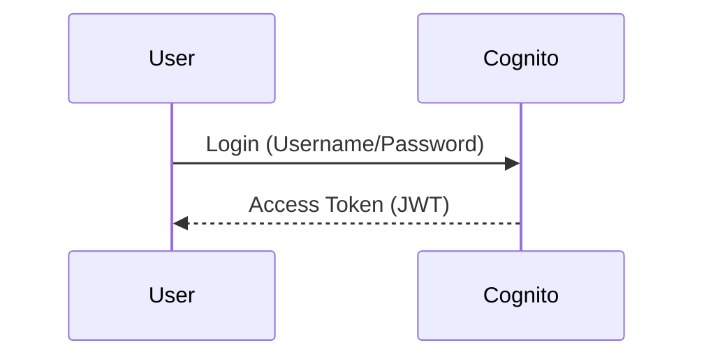
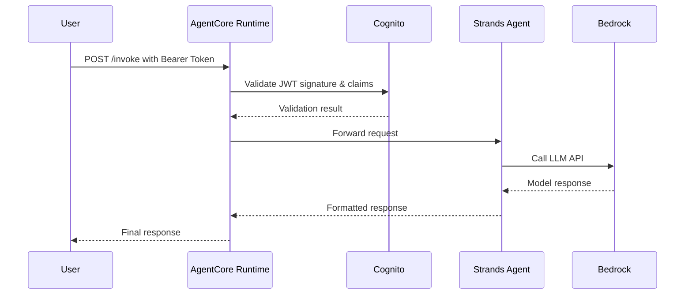

# Inbound Auth with AgentCore Runtime and Cognito - Architecture Overview

## Workshop Summary
This workshop demonstrates how to implement **Inbound Authentication** for AgentCore Runtime using **Amazon Cognito** as the identity provider. You'll learn to secure your AI agents by validating user access tokens before processing requests.

## Architecture Diagram
```
+----------------+       +----------------------+       +-------------------+
|                |       |                      |       |                   |
|   User Client  |-----> |   AgentCore Runtime  |-----> |   Strands Agent    |
|                |       | (with Inbound Auth)   |       | (Python + Bedrock) |
+----------------+       +----------------------+       +-------------------+
        |                        |                          |
        | 1. Request w/ Bearer    |                          |
        |    Token                |                          |
        |------------------------>|                          |
                                |                          |
                                | 2. Validate JWT w/        |
                                |    Cognito                |
                                |                          |
                                |------------------------->|
                                |                          |
                                | 3. Process request        |
                                |    using Strands Agent    |
                                |    + Bedrock model         |
                                |<-------------------------|
        | 4. Return response     |                          |
        <------------------------|                          |
```

## Components

### 1. Amazon Cognito
- **User Pool**: Stores user identities and credentials
- **App Client**: Configured for OAuth 2.0 with JWT token issuance
- **Discovery Endpoint**: Provides OpenID Connect configuration (`/.well-known/openid-configuration`)
- **JWT Validation**: AgentCore Runtime validates access tokens against Cognito's public keys

### 2. AgentCore Runtime
- **Inbound Auth Configuration**: 
  - `authorizer_configuration` in `.bedrock_agentcore.yaml`
  - `customJWTAuthorizer` with Cognito discovery URL and allowed clients
- **Deployment**:
  - Packaged as Docker container
  - Pushed to Amazon ECR
  - Deployed via Bedrock AgentCore SDK
- **Endpoint**: HTTP endpoint secured with JWT validation

### 3. Strands Agent (Python)
- **Framework**: Built with [Strands](https://github.com/strands)
- **Model**: Uses Amazon Bedrock models (e.g., Anthropic Claude)
- **Tools**: Custom tools like calculator and weather (dummy implementation)
- **Entry Point**: `strands_claude.py` with BedrockAgentCoreApp integration

### 4. AWS Services Integration
- **IAM**: Execution roles for CodeBuild, ECR, and AgentCore Runtime
- **CodeBuild**: Builds and deploys the Docker container
- **ECR**: Stores the container image
- **CloudWatch**: Logs and metrics collection
- **X-Ray**: Distributed tracing

## Workflow

### 1. User Authentication


### 2. Request Processing


### 3. Authorization Check
The AgentCore Runtime validates:
- **Audience**: Matches allowed clients from Cognito
- **Issuer**: Matches Cognito user pool endpoint
- **Expiration**: Token not expired
- **Signature**: Verified using Cognito's public keys

## Key Configuration Snippets

### Cognito Configuration (`.bedrock_agentcore.yaml`)
```yaml
authorizer_configuration:
  customJWTAuthorizer:
    discoveryUrl: https://cognito-idp.us-east-1.amazonaws.com/us-east-1_RDMn70LZb/.well-known/openid-configuration
    allowedClients:
      - 323fq61m4rf5ib3dvv71m92vha
```

### Runtime Configuration (Python SDK)
```python
response = agentcore_runtime.configure(
    entrypoint="strands_claude.py",
    auto_create_execution_role=True,
    auto_create_ecr=True,
    requirements_file="requirements.txt",
    region=region,
    agent_name="strands_agent_inbound_identity",
    authorizer_configuration={
        "customJWTAuthorizer": {
            "discoveryUrl": discovery_url,
            "allowedClients": [client_id],
        }
    },
)
```

## Security Best Practices
1. **Least Privilege**: Use minimal IAM permissions for execution roles
2. **Token Expiry**: Set appropriate JWT expiration times
3. **Audience Restriction**: Limit allowed clients to known applications
4. **HTTPS**: Always use secure connections to AgentCore endpoints
5. **Audit Logging**: Enable CloudTrail and CloudWatch logging

## Workshop Steps Recap
1. **Setup Cognito**: Create user pool and app client
2. **Create Strands Agent**: Implement Python agent with Bedrock integration
3. **Configure Runtime**: Set up AgentCore with JWT authorizer
4. **Deploy**: Launch runtime via Bedrock AgentCore SDK
5. **Test**: Invoke with/without valid bearer tokens
6. **Cleanup**: Delete runtime and ECR repository

## Troubleshooting Tips
- **Authorization Errors**: Verify Cognito discovery URL and client ID
- **ECR Issues**: Check repository name format (must match regex `[a-z0-9]+(/[a-z0-9-]+)*`)
- **Token Validation**: Ensure clock skew between services is minimal
- **Logging**: Check CloudWatch logs for detailed error messages

This architecture provides a secure foundation for building AI applications with proper user authentication and authorization.