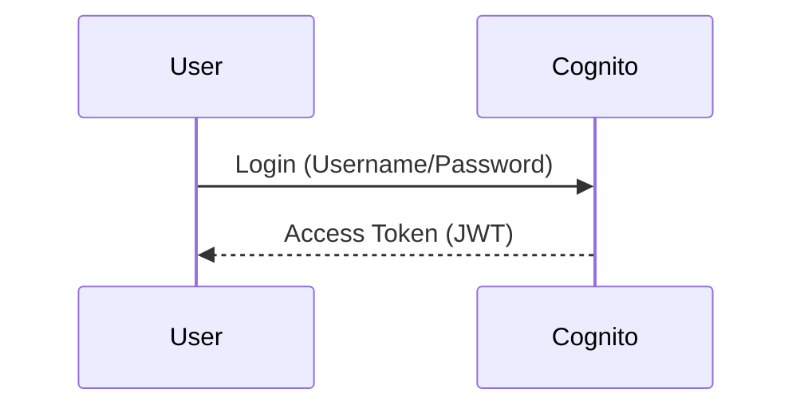
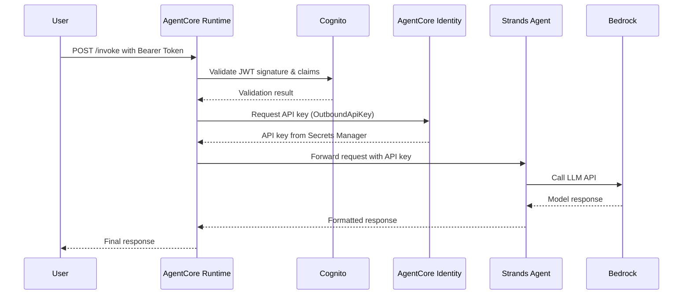

# AgentCore Identity: Runtime Inbound and Outbound Auth (Cognito) - Architecture Overview

## Workshop Summary
This workshop demonstrates how to secure an **AgentCore Runtime** agent with both **inbound and outbound authentication** using **Amazon Cognito** as the identity provider and **AgentCore Identity** for outbound API key management. You'll learn to:
- Protect your runtime endpoint with Cognito JWT validation (inbound auth)
- Securely retrieve API keys from AgentCore Identity at runtime (outbound auth)
- Implement zero-secret agent code where credentials never appear in environment variables or code

## Architecture Diagram
```
+----------------+       +----------------------+       +-------------------+
|                |       |                      |       |                   |
|   User Client  |-----> |   AgentCore Runtime  |-----> |   Strands Agent    |
|                |       | (with Inbound/Outbound|       | (Python + Bedrock) |
+----------------+       |   Auth)               |       +-------------------+
         |                +----------------------+       
         | 1. Request w/  |                          |
         |    Bearer Token|------------------------>|                          |
         |                |                          |
         |                | 2. Validate JWT w/      |
         |                |    Cognito (Inbound)    |
         |                |                          |
         |---------------->| 3. Fetch API Key w/    |
         |                |    AgentCore Identity   |
         |                |    (Outbound)           |
         |                |                          |
         |                |------------------------->|
         |                |                          |
         |                | 4. Process request       |
         |                |    using Strands Agent   |
         |                |    + Bedrock model       |
         |                |<-------------------------|
         | 5. Return       |                          |
         |    response     |                          |
         <----------------+
```

## Components

### 1. Amazon Cognito
- **User Pool**: Stores user identities and credentials
- **App Client**: Configured for OAuth 2.0 with JWT token issuance
- **Discovery Endpoint**: Provides OpenID Connect configuration (`/.well-known/openid-configuration`)
- **JWT Validation**: AgentCore Runtime validates access tokens against Cognito's public keys

### 2. AgentCore Runtime
- **Inbound Auth Configuration**: 
  - `authorizer_configuration` in `agentcore.json`
  - `customJWTAuthorizer` with Cognito discovery URL and allowed clients
- **Outbound Auth Integration**:
  - Calls AgentCore Identity service to retrieve API keys at runtime
  - Uses `@requires_api_key` decorator to securely handle credentials
- **Deployment**:
  - Packaged as Docker container
  - Pushed to Amazon ECR
  - Deployed via Bedrock AgentCore SDK
- **Endpoint**: HTTP endpoint secured with JWT validation and API key requirements

### 3. AgentCore Identity
- **API Key Management**: Stores and manages API keys in AWS Secrets Manager
- **Credential Retrieval**: Provides secure API to retrieve credentials at runtime
- **Integration**: Used by Strands agent via `@requires_api_key` decorator

### 4. Strands Agent (Python)
- **Framework**: Built with [Strands](https://github.com/strands)
- **Model**: Uses Amazon Bedrock models (e.g., Anthropic Claude)
- **Tools**: Custom tools like calculator and weather with secure API key handling
- **Entry Point**: `main.py` with BedrockAgentCoreApp integration
- **Security**: API keys never stored in code or environment variables

### 5. AWS Services Integration
- **IAM**: Execution roles for CodeBuild, ECR, and AgentCore Runtime
- **CodeBuild**: Builds and deploys the Docker container
- **ECR**: Stores the container image
- **CloudWatch**: Logs and metrics collection
- **X-Ray**: Distributed tracing
- **Secrets Manager**: Stores API keys managed by AgentCore Identity

## Workflow

### 1. User Authentication


### 2. Request Processing


### 3. Authorization Checks
The AgentCore Runtime validates:
- **Audience**: Matches allowed clients from Cognito
- **Issuer**: Matches Cognito user pool endpoint
- **Expiration**: Token not expired
- **Signature**: Verified using Cognito's public keys
- **API Key**: Valid and present for outbound API calls

## Key Configuration Snippets

### Cognito Configuration (`agentcore.json`)
```json
{
  "tags": {
    "agentcore:created-by": "agentcore-cli",
    "agentcore:project-name": "RuntimeAuthDemo",
    "Project": "Workshop-Agentcore",
    "Owner": "Pathipat",
    "Environment": "Dev"
  },
  "runtimes": [],
  "memories": [],
  "knowledgeBases": [],
  "credentials": [],
  "evaluators": [],
  "onlineEvalConfigs": [],
  "agentCoreGateways": [],
  "policyEngines": [],
  "configBundles": [],
  "abTests": [],
  "harnesses": [],
  "datasets": [],
  "payments": []
}
```

### Runtime Configuration (Python SDK)
```python
@app.entrypoint
async def handler(payload: dict) -> str:
    global _agent
    
    # Fetch the outbound API key on first invocation
    if "key" not in _api_key_cache:
        await _fetch_api_key(api_key="")
        os.environ["OUTBOUND_API_KEY"] = _api_key_cache.get("key", "")
    
    if _agent is None:
        _agent = Agent(
            model=_model,
            tools=[get_weather, calculate],
            system_prompt=("You are a helpful assistant. You can check the weather and perform calculations."),
        )
    
    user_input = payload.get("prompt", "")
    response = _agent(user_input)
    return response.message["content"][0]["text"]
```

### API Key Decorator
```python
@requires_api_key(provider_name="OutboundApiKey")
async def _fetch_api_key(*, api_key: str) -> None:
    """Retrieve the outbound API key from AgentCore Identity."""
    _api_key_cache["key"] = api_key
```

## Security Best Practices
1. **Least Privilege**: Use minimal IAM permissions for execution roles
2. **Token Expiry**: Set appropriate JWT expiration times
3. **Audience Restriction**: Limit allowed clients to known applications
4. **HTTPS**: Always use secure connections to AgentCore endpoints
5. **Audit Logging**: Enable CloudTrail and CloudWatch logging
6. **Zero-Secret Code**: Never store credentials in code or environment variables
7. **API Key Rotation**: Regularly rotate API keys through AgentCore Identity

## Workshop Steps Recap
1. **Setup Cognito**: Create user pool and app client
2. **Create Strands Agent**: Implement Python agent with Bedrock integration and secure API key handling
3. **Configure Runtime**: Set up AgentCore with JWT authorizer and AgentCore Identity integration
4. **Deploy**: Launch runtime via Bedrock AgentCore SDK
5. **Test**: Invoke with/without valid bearer tokens and API keys
6. **Cleanup**: Delete runtime and ECR repository

## Troubleshooting Tips
- **Authorization Errors**: Verify Cognito discovery URL, client ID, and API key configuration
- **ECR Issues**: Check repository name format (must match regex `[a-z0-9]+(/[a-z0-9-]+)*`)
- **Token Validation**: Ensure clock skew between services is minimal
- **API Key Errors**: Verify API key exists in AgentCore Identity and is properly named
- **Logging**: Check CloudWatch logs for detailed error messages

This architecture provides a comprehensive security foundation for building AI applications with proper user authentication (inbound) and secure API access (outbound) management.